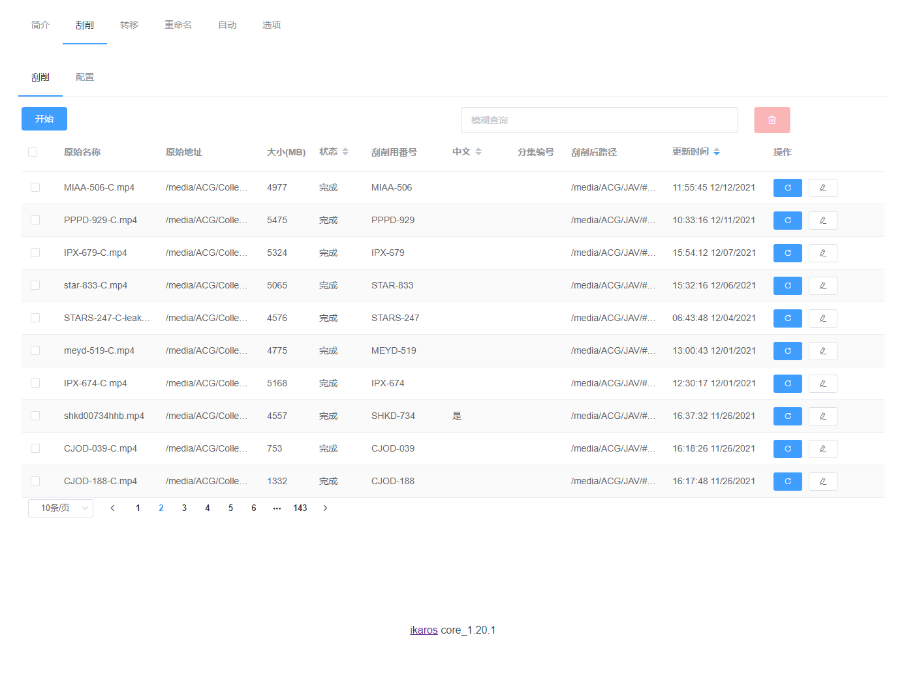
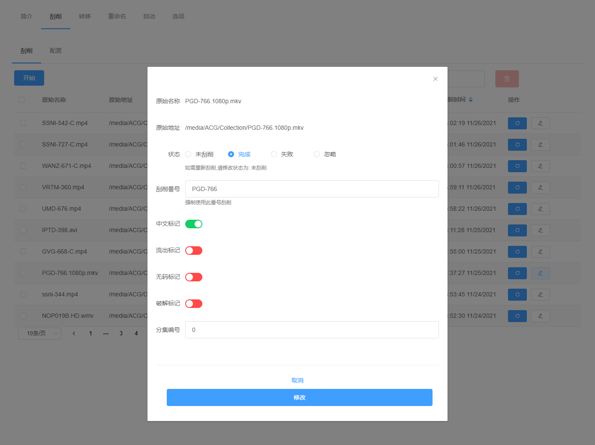
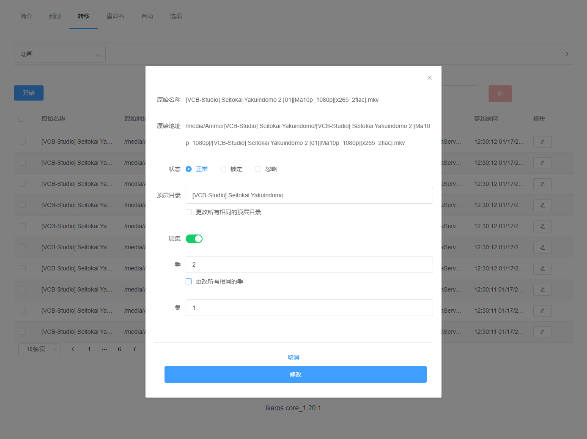

# ikaros

[](https://github.com/suwmlee/ikaros/actions) [](https://github.com/suwmlee/ikaros/releases) [](https://hub.docker.com/r/suwmlee/ikaros)

解决下载软件与媒体服务内诸多问题，安心享受影片

特性:
- 批量软/硬链接
- 批量修改文件名，优化剧集名及自定义
- JAV刮削及自定义
- 自动清理关联的软/硬链接及种子文件
- 托管（忘记这款软件，安心看片）

关联`transmission`/`qBittorrent`与`emby`。
下载完成后，自动筛选文件创建软/硬链接，刮削JAV目录，推送emby库刷新，清理失效文件/种子。<br>
只需要在网页内操作，不需要打开文件夹，不需要使用命令行

### 安装

本项目仅后端，需要搭配[ikaros-web](https://github.com/Suwmlee/ikaros-web)  
可自行编译或使用编译好的文件

- 使用编译好的[web release](https://github.com/Suwmlee/ikaros-web/tree/release)
  (机器已安装`python`与`pip`)
  1. 将`index.html`放到`web/templates`
  2. 将其他文件放到`web/static`
  3. `pip install -r requirements.txt`
  4. `python app.py`

- 使用[docker](https://registry.hub.docker.com/r/suwmlee/ikaros)(推荐)
  ```sh
  docker run -d \
    --name=ikaros \
    -e PUID=0 \
    -e PGID=0 \
    -e TZ=Asia/Shanghai \
    -p 12346:12346 \
    -v /path/to/media:/media \
    -v /path/to/data:/app/data \
    --restart unless-stopped \
    suwmlee/ikaros:latest
  ```
  默认 `PUID=0 PGID=0`,即使用root权限。可以用 __id__ 命令查找具体用户值:
  ```
  $ id abc
    uid=1000(abc) gid=1000(users) groups=1000(users)
  ```

- 群晖docker
  1. 设置存储空间映射
    


__注:__ 
- 默认Web访问端口:  __12346__
- 可以使用[watchtower](https://hub.docker.com/r/containrrr/watchtower)自动化更新Docker

### 默认WEB界面预览

 
|                 刮削                  |                    转移文件                     |
| :-----------------------------------: | :---------------------------------------------: |
|      |      |
|  |  |

### 文档

[使用说明](docs/intro.md)

### TODO

1. 更新 webui
2. 保留删除记录
3. 自动检测文件夹，不需要关联下载器

### 感谢

[Movie_Data_Capture](https://github.com/yoshiko2/Movie_Data_Capture)
