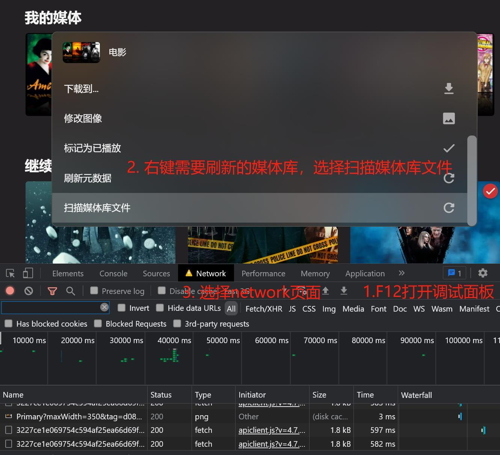
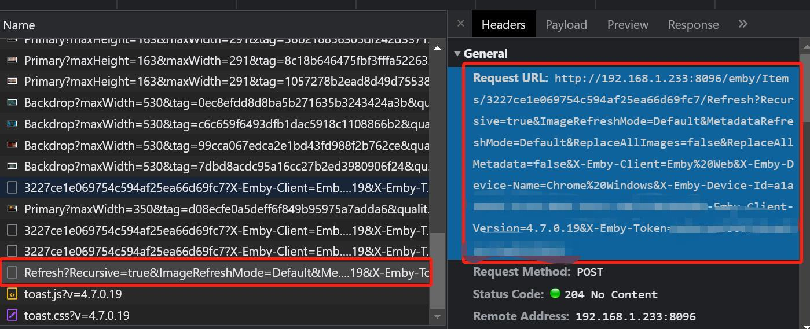

## 使用说明

### 配置

##### JAV刮削

配置可参考 [Movie_Data_Capture wiki](https://githubfast.com/yoshiko2/Movie_Data_Capture/wiki)<br>
~~使用mdc的刮削库，参数略有修改~~

刮削默认跳过带有忽略或已完成标记的影片。
需自定义刮削番号/中文标签时，需要将状态设置为`未完成`或直接点击刷新按钮

~~填写cookies: 复制浏览器内完整的cookies,直接拖动选择后复制,非右键`copy value`,不需要json格式~~<br>
(鉴于目前cookies并不能帮助获取额外的刮削内容,填写cookies的意义不大)

##### 转移

开启`修正剧集名`后，剧集文件夹最多两级目录结构。
第一级是`剧集名字`，第二级是`季`或者特典目录`Specials`。如果同一电视剧有多季的文件夹是分散开的，也不需要担心，emby会自动将多季归到一个剧集内展示。<br>
遇到异常的视频，可参考tmdb内数据，在web页面内修改`季/集`编号或文件名，并再次进行转移操作。

_请在web页面内进行自定义修改，这样ikaros会更新记录，再次转移会应用修改_<br>
_[媒体文件分类/命名参考](https://suwmlee.github.io/posts/2021/12/05/%E5%AA%92%E4%BD%93%E6%96%87%E4%BB%B6%E5%91%BD%E5%90%8D.html)_<br>
_特典SP剧集的季编号为 0_<br>
_在命名与网络正常的情况下，emby自带的刮削功能完全可以满足日常使用，即使出现个别问题，也可以手动修改_
_仅转移视频文件，jpg/png/nfo等不会转移_

### 自动清理

自动清理任务会删除文件，如果设置了下载服务器，则会删除对应的种子文件。

可配合emby内删除影片功能，在emby内删除后，会自动检测删除的影片。查找关联的源文件，到期后自动删除。
默认7天的缓冲时间。
<br>
__请慎重填写下载服务器__

### 获取刷新emby库地址

__注:__ 如果Emby库内设置`实时监控`则不需要进行此设置,二者都有优点,选择适合自己的方案即可

在刮削和转移配置内填入`emby链接`即可在任务完成后刷新emby库

刷新emby需要查找刷新地址，[参考论坛回复](https://emby.media/community/index.php?/topic/50862-trigger-a-library-rescan-via-cmd-line/&do=findComment&comment=487929)

具体按图示操作:

图 1: 网页内刷新媒体库<br>


图 2: 查找媒体刷新链接<br>


找到刷新该媒体库的地址:
```
http://192.168.1.233:8096/emby/Items/3227ce1e069754c594af25ea66d69fc7/Refresh?Recursive=true&ImageRefreshMode=Default&MetadataRefreshMode=Default&ReplaceAllImages=false&ReplaceAllMetadata=false&X-Emby-Client=Emby Web&X-Emby-Device-Name=Chrome Windows&X-Emby-Device-Id=123123123214123&X-Emby-Client-Version=4.7.0.19&X-Emby-Token=123123412312312
```

得到媒体库item的ID为:`3227ce1e069754c594af25ea66d69fc7`

在emby服务端`控制面板 - 高级 - API密钥` 获取 __api_key__ : `dd4b16934ab81cbxxxxxx`

替换找到的刷新链接`itemid`和`ReplaceAllMetadata=false`后半部分:
```
http://192.168.1.233:8096/emby/Items/3227ce1e069754c594af25ea66d69fc7/Refresh?Recursive=true&ImageRefreshMode=Default&MetadataRefreshMode=Default&ReplaceAllImages=false&ReplaceAllMetadata=false&api_key=dd4b16934ab81cbxxxxxx
```

以上地址即填入的刷新emby链接

~~emby也提供了其他刷新方式，但实现会麻烦很多，有兴趣的可以提交PR~~

### 关联 transmission/qBittorrent

- 配置 transmission/qBittorrent 下载完成脚本
  - 脚本在项目的`scripts`目录，或在web页面里查看并自行创建脚本
  - 在下载软件配置内指定脚本路径
- 在`自动`选项卡里配置过滤目录
- ~~后续可能修改策略,直接扫描下载目录,不需要配置这些~~
__注:__ 
- 默认请求 __127.0.0.1__ ,需根据实际情况更改
- tr可参考[配置完成脚本](https://githubfast.com/ronggang/transmission-web-control/wiki/About-script-torrent-done-filename)
- 如果docker的挂载路径与qbit挂载路径不同名的话，需要用以下命令a="%F"&& sh qbcomplete.sh ${a/bit挂载路径/ikros挂载路径}，tr同理

### 其他

- 软连接:相对映射路径，可以修改前缀，有些复杂。没有特殊需求，使用硬链接即可
- 软链接只在有实际指向文件的环境内生效，适应范围单一
- 软链接清理只需要删除源文件即可，硬链接需要删除源文件与硬连接后的文件
